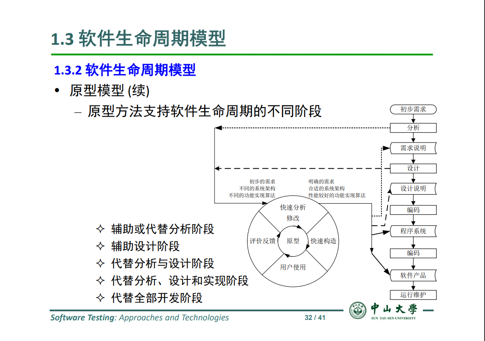
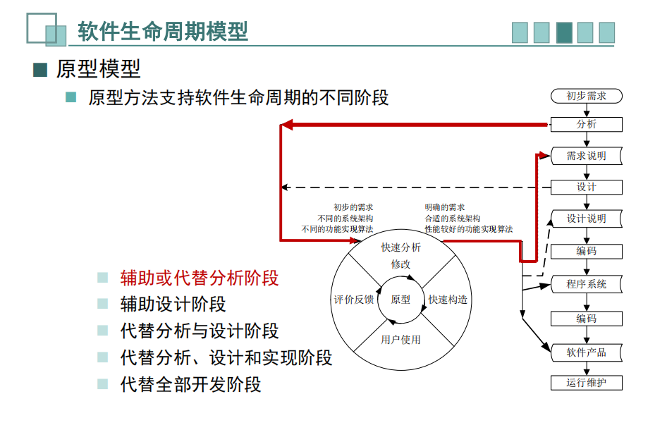
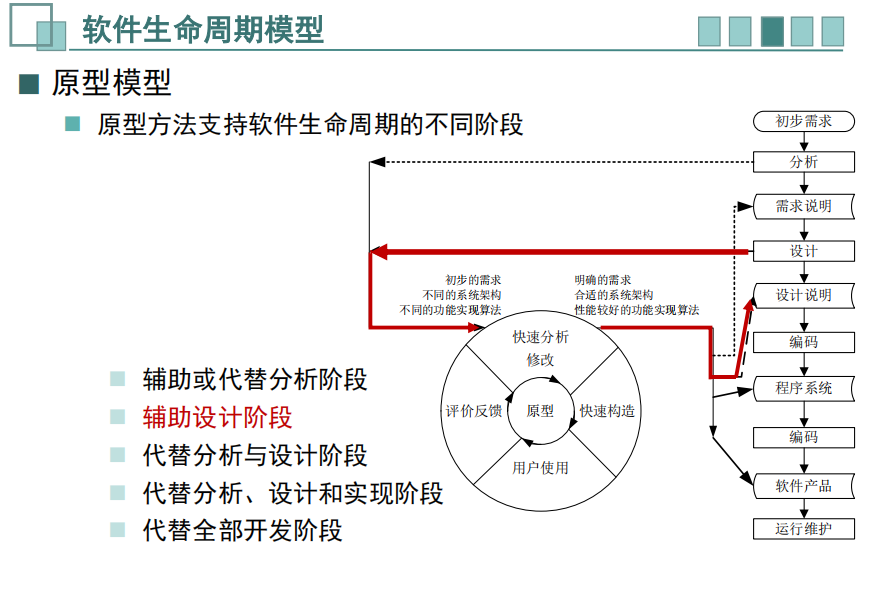
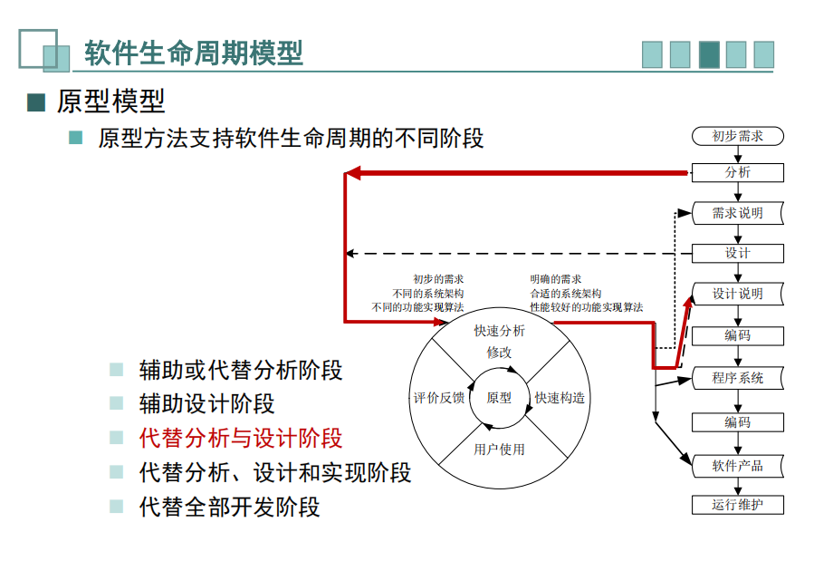
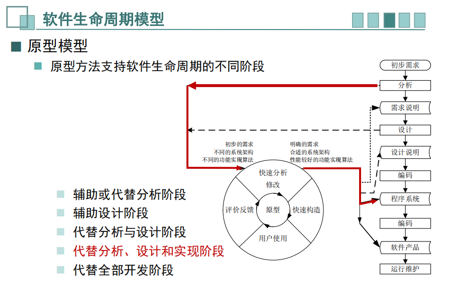
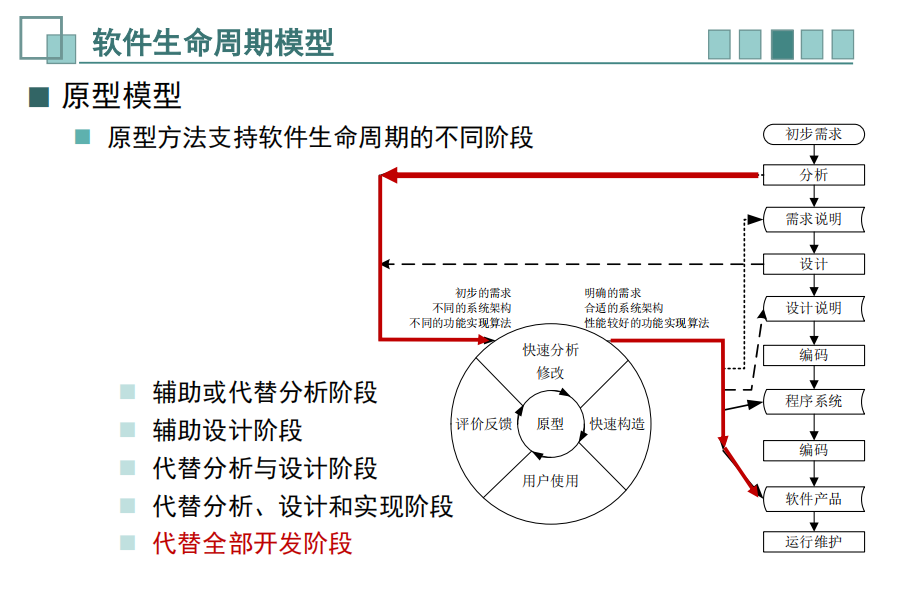

# 软件测试  -- Homework 1

### 姓名：陈明亮

### 学号：16340023

## 软件生命周期模型图

## 一、辅助或代替分析阶段

**辅助或代替分析阶段：**

输入：初步需求 -> 分析 -> [进入原型方法的循环：快速分析需求 -> 快速构造需求说明 -> 用户使用 -> 评价反馈 -> 根据反馈继续循环直到得到明确的需求说明] -> 设计(设计说明) -> 编码 -> 程序系统 -> 输出：软件产品 -> 运行维护

 

## 二、辅助设计阶段

**辅助设计阶段：**

输入：初步需求 -> 需求分析 -> 设计 -> [进入原型方法的循环：根据需求快速分析 -> 快速构造设计说明 -> 用户使用（工程师测试等） -> 评价反馈 -> 根据反馈继续循环直到得到完善的设计说明(合适的系统架构设计等)] -> 编码 -> 程序系统 -> 输出：软件产品 -> 运行维护

 

## 三、代替分析与设计阶段

**代替分析与设计阶段：**

输入：初步需求 -> 分析 -> [进入原型方法的循环：快速分析需求 -> 快速构造设计说明 -> 用户使用 -> 评价反馈 -> 根据反馈继续循环直到得到完善的需求说明和设计说明] -> 编码 -> 程序系统 -> 输出：软件产品 -> 运行维护

 

## 四、代替分析、设计和实现阶段

**代替分析、设计和实现阶段：**

输入：初步需求 -> 分析 -> [进入原型方法的循环：快速分析需求 -> 快速构造设计说明 -> 快速构造程序系统（编码） -> 用户使用程序系统 -> 评价反馈 -> 根据反馈继续循环直到得到完善的需求说明、设计说明和程序系统] -> 编码 -> 程序系统 -> 输出：软件产品 -> 运行维护

 

## 五、代替全部开发阶段

**代替全部开发阶段：**

输入：初步需求 -> 分析 -> [进入原型方法的循环：快速分析需求 -> 快速构造设计说明 -> 快速构造程序系统和软件产品（编码） -> 用户使用（程序系统或软件产品） -> 评价反馈 -> 根据反馈继续循环直到得到完善的需求说明、设计说明和软件产品] -> 输出：软件产品 -> 运行维护